# 🛒 Ecommerce PHP — Refonte sécurité & design 2026

Site e-commerce PHP/MySQL complet (boutique + back-office), modernisé :

- 🔐 **Sécurité durcie** — bcrypt, anti-falsification de prix, XSS/CSRF, sessions
- 🎨 **Design 2026** — refonte complète animée, 4 palettes interchangeables
- ⚡ **Performances** — requêtes SQL N+1 éliminées

> D'après le template e-commerce de [CodeAstro](https://codeastro.com) (Hammad Hassan), largement remanié.

---

## 📸 Aperçu du design

### Page d'accueil

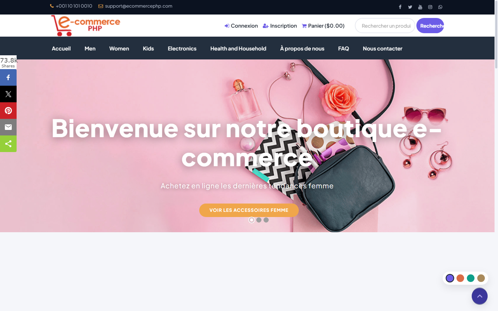

### Les 4 palettes (sélecteur intégré en bas à droite, choix mémorisé)

| Défaut (violet) | Chaleureuse |
|:---:|:---:|
|  | 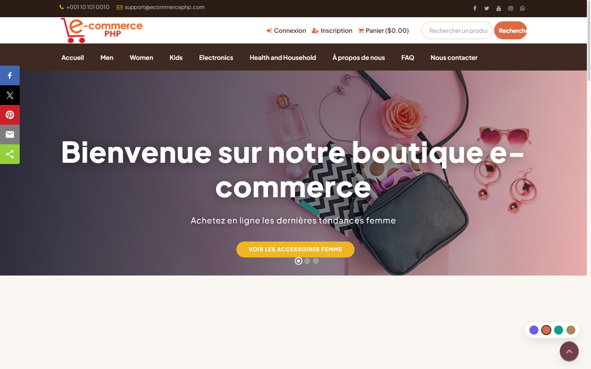 |
| **Froide** | **Luxe (typographie serif)** |
| 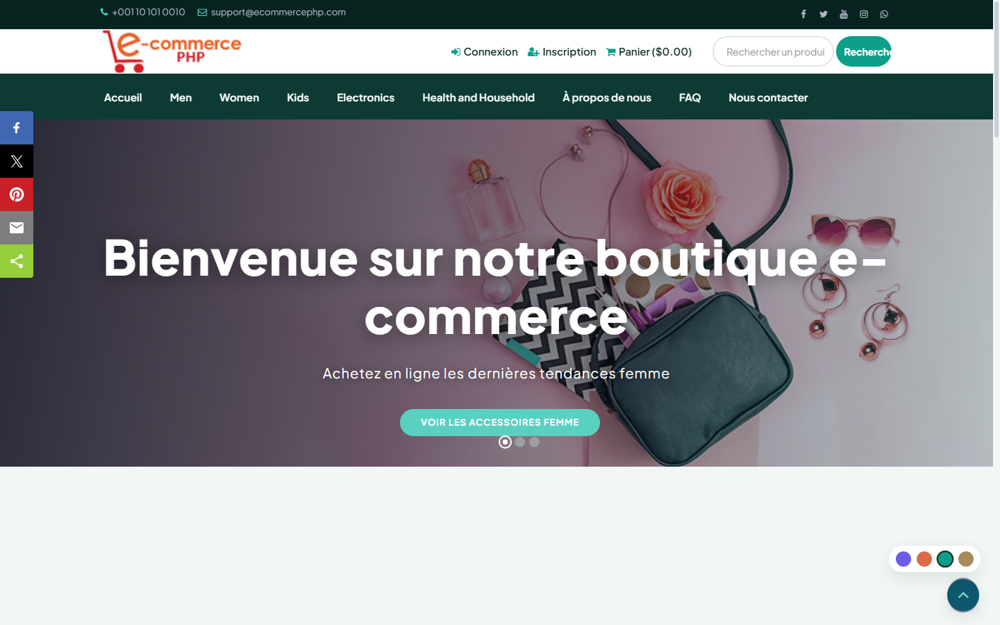 | 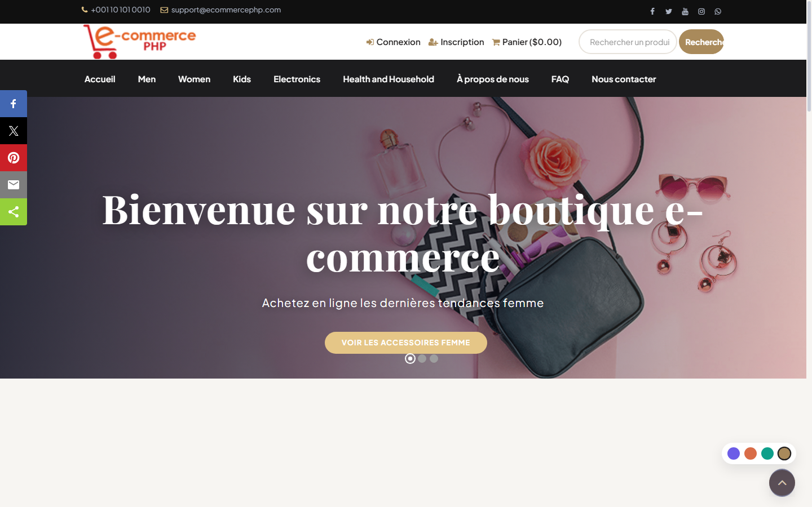 |

### Fiche produit

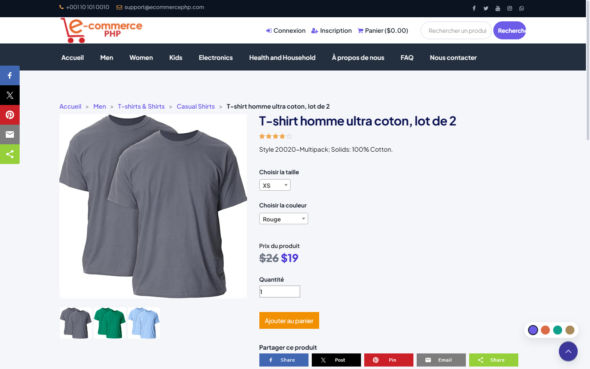

### Catégorie & recherche

| Catégorie | Recherche |
|:---:|:---:|
| 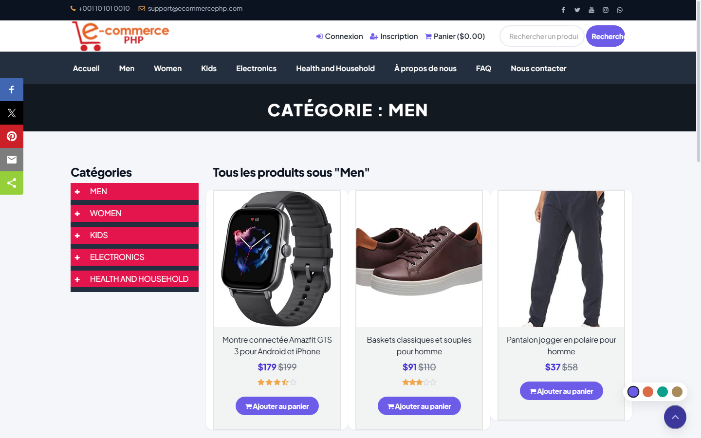 | 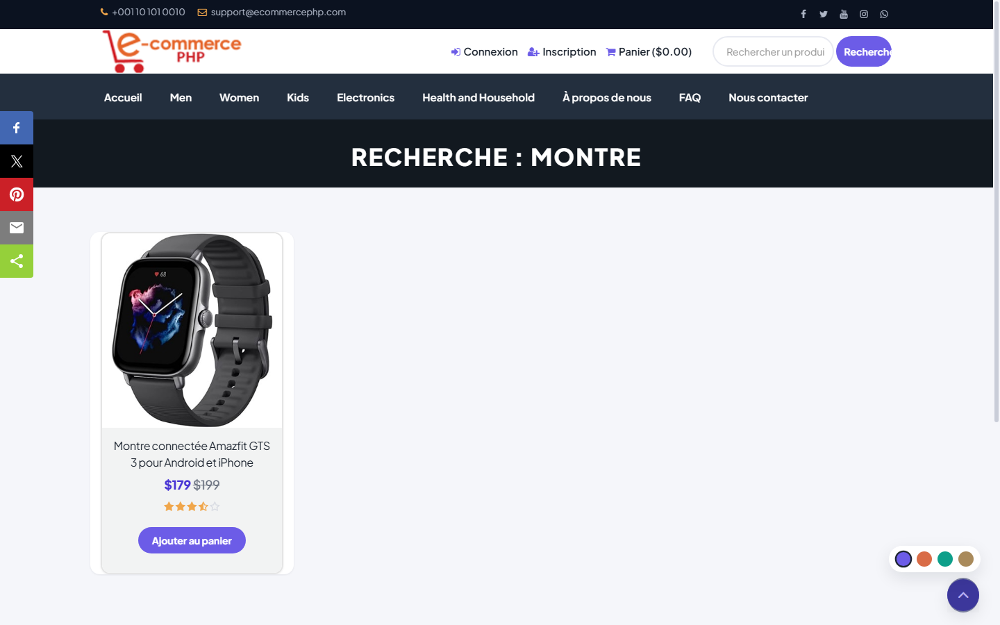 |

### Compte client

| Connexion | Inscription |
|:---:|:---:|
| 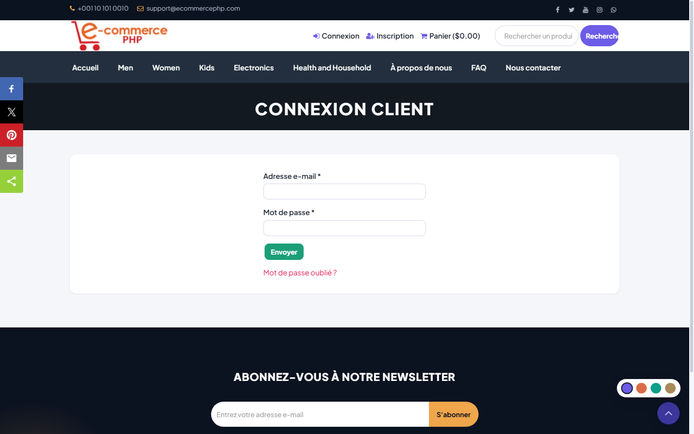 | 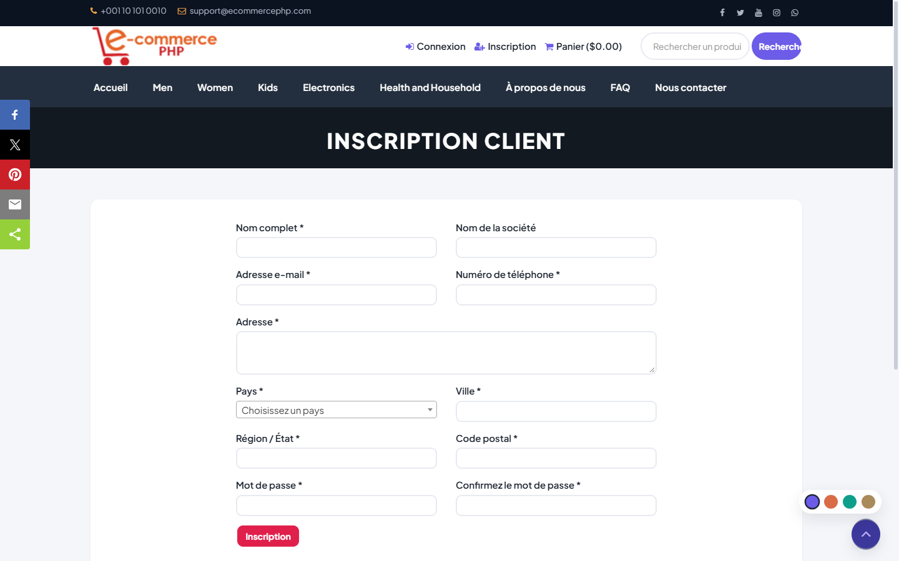 |

### Pages d'information

| FAQ | Contact | À propos |
|:---:|:---:|:---:|
| 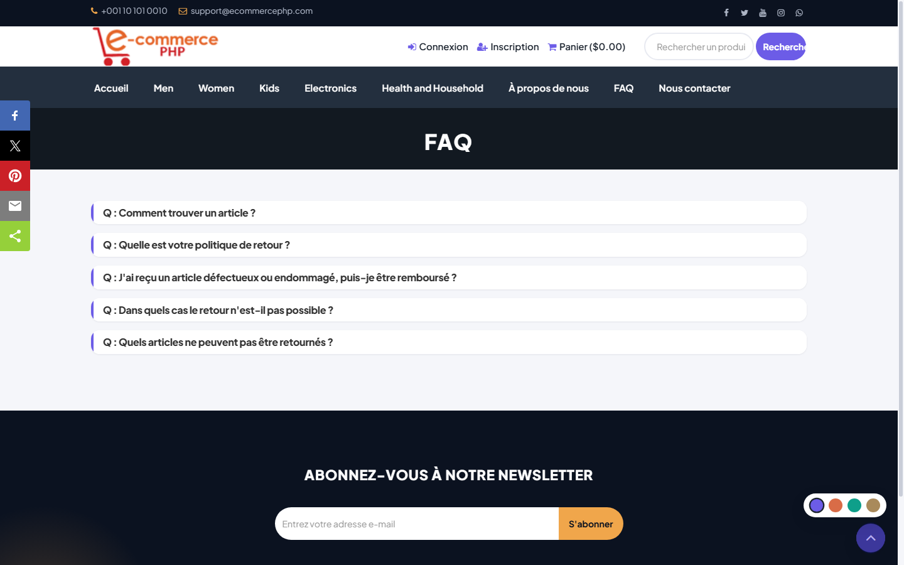 | 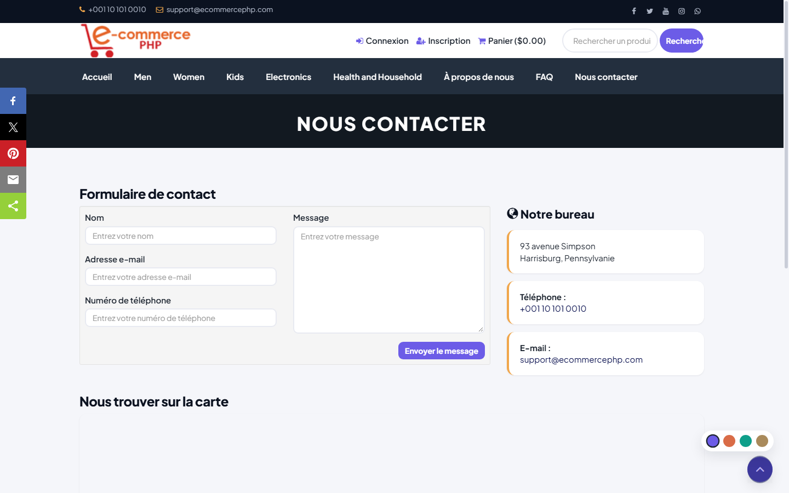 | 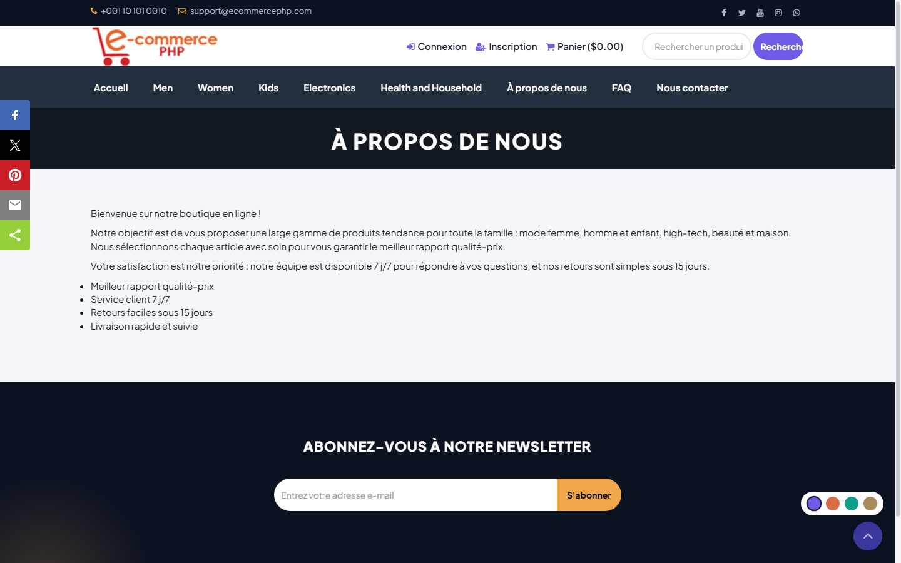 |

### Back-office (AdminLTE restylé)

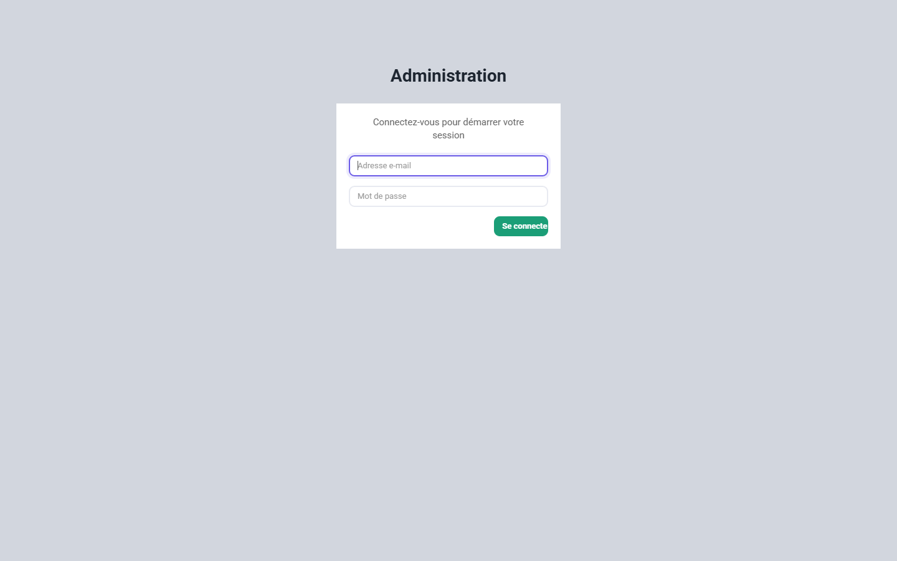

---

## ✨ Fonctionnalités

**Boutique** : catalogue 3 niveaux de catégories • carrousels (vedette / nouveaux / populaires) • fiche produit avec taille, couleur, notes ★ • panier session • recherche avec pagination • frais de livraison par pays • multi-langue (base de données)

**Paiement** : PayPal (IPN) • virement bancaire

**Client** : tableau de bord • profil • adresses facturation/livraison • historique de commandes • changement de mot de passe • vérification d'email

**Admin** : CRUD produits/catégories/sliders/services • gestion commandes & statuts • clients • frais de port • FAQ • abonnés (export CSV) • réglages • profil

## 🔐 Sécurité (travail réalisé)

| Domaine | Mise en œuvre |
|---|---|
| Mots de passe | `password_hash()`/`password_verify()` (bcrypt) avec **migration auto transparente** des comptes MD5 à la connexion |
| Prix & quantités | **Recalcul serveur** au checkout et dans les 2 processeurs de paiement (les prix postés ne sont plus utilisés) |
| XSS | Échappement systématique des sorties via `e()`, texte de recherche encodé |
| CSRF | Vérification sur tous les POST admin + formulaires boutique |
| Sessions | Cookies `HttpOnly`/`SameSite=Lax`, régénération d'ID à la connexion |
| Comptes | Vérification d'email **par token obligatoire** (le lien sans token n'active plus rien) |
| Base de données | InnoDB + utf8mb4 partout, unicité email, index de performance — voir `DATABASE FILE/migrate-security.sql` pour une base existante |

## 🎨 Design (thème)

- `assets/css/theme.css` — système de design complet piloté par **variables CSS**
- `assets/css/theme-variants.css` — 3 palettes additionnelles (chaleureuse / froide / luxe)
- `assets/js/theme.js` — animations : révélation au scroll, header sticky, ripple, transitions de page, preloader
- Sélecteur de palette en bas à droite (persisté en `localStorage`), ou forçable par URL : `?palette=warm`
- Respect de `prefers-reduced-motion`

## ⚡ Performances

- Notes produits : les moyennes sont chargées **en 1 requête par liste** (`fetch_ratings_bulk`) au lieu d'une requête par produit (accueil : 31 → 3)
- Bloc étoiles mutualisé (`render_rating_stars`) — ~320 lignes dupliquées supprimées
- Purge des paiements en attente limitée à 1 fois/heure (gate en session)

## 🚀 Installation

**Prérequis** : PHP 7.4+ (8.x recommandé), MySQL 5.7+ / MariaDB, serveur web

1. Copier le dossier dans votre racine web (`htdocs`, `www`…)
2. Importer `DATABASE FILE/ecommerceweb.sql` (crée la base `ecommerceweb`)
   - *Base existante d'une ancienne installation* : exécuter plutôt `DATABASE FILE/migrate-security.sql`
3. Ajuster les identifiants dans `admin/inc/config.php`
4. Ouvrir le site — comptes de démo :

| Rôle | Identifiants |
|---|---|
| Admin | `admin@mail.com` / `Password@123` |
| Client | `liam@mail.com` / `password` |

> 💡 Développement local rapide : `php -S 127.0.0.1:8088` à la racine du projet.

## 🗂 Structure

```
├── admin/              Back-office (AdminLTE) + inc/ (config, sécurité, helpers)
├── assets/
│   ├── css/theme.css   Design system (variables CSS)
│   ├── css/theme-variants.css   3 palettes
│   └── js/theme.js     Animations
├── payment/            PayPal (IPN) & virement bancaire
├── DATABASE FILE/      Dump SQL + script de migration sécurité
└── docs/screenshots/   Captures du design
```

---

⚠️ **Production** : changer les mots de passe de démo, configurer un SMTP réel (l'envoi utilise `mail()`), et passer PayPal en mode live avec vos identifiants.
